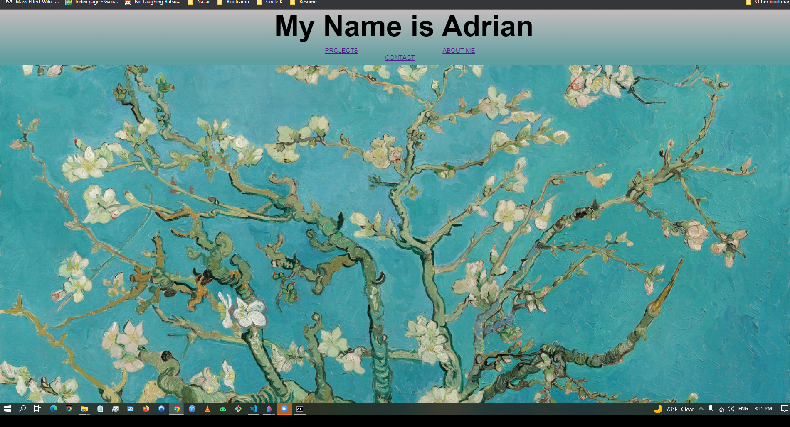
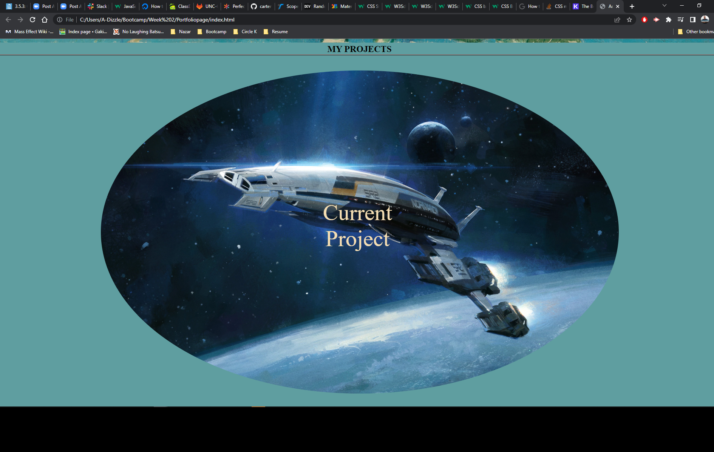

# Portfoliopage

## Description

Provide a short description explaining the what, why, and how of your project. Use the following questions as a guide:

The page was put together as a standing and ever-changing showcase of my work over the course of this program. Here one will be able to find and examine the work I have and am currently working at completing. It makes it convenient to find all my work. On the page it will make a viewable account of what I have learned over the six months of the class.

## Installation

What are the steps required to install your project? Provide a step-by-step description of how to get the development environment running.

## Usage

The site is simple to navigate. Use the nav bar to take you to a portion of the page that contains the information you are interested in learning

To add a screenshot, create an `assets/images` folder in your repository and upload your screenshot to it. Then, using the relative file path, add it to your README using the following syntax:

